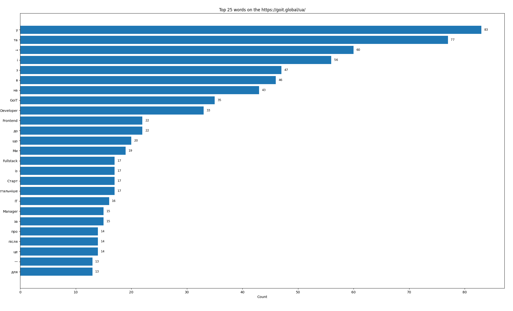

# goit-algo2-hw-06

## Description

Program that takes a URL as an argument and visualizes the top 25 words from the page.

## Installation

```bash
pip install -r requirements.txt
```

## Usage

```bash
python main.py --url <url>
```


## Example
By default, the program will use the URL `https://goit.global/ua/`
```bash
python main.py
```

Output:


